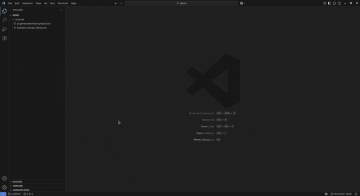

# 

[](https://marketplace.visualstudio.com/items?itemName=rafa-mori.lookatni-file-markers)
[](https://marketplace.visualstudio.com/items?itemName=rafa-mori.lookatni-file-markers)
[](https://marketplace.visualstudio.com/items?itemName=rafa-mori.lookatni-file-markers)
[](https://marketplace.visualstudio.com/items?itemName=rafa-mori.lookatni-file-markers)
[](LICENSE)
[](https://marketplace.visualstudio.com/items?itemName=rafa-mori.lookatni-file-markers)

---

🚀 **Revolutionary AI code extraction + visual file organization system**

## 🏆 The Golden Tip: AI-Generated Code Made Easy

**The Problem:** AI generates amazing code in single files, but extracting them into proper project structures is tedious and error-prone.

**The Solution:** LookAtni File Markers! Generate entire projects in one document, then **extract them automatically** into perfect file structures.

## 🎯 What is LookAtni File Markers?

LookAtni File Markers is the **first extension to combine**:

### 🤖 **AI Code Extraction** (Revolutionary)

```typescript
// AI generates code with invisible markers - you extract perfect projects!
// Uses invisible File Separator characters (ASCII 28)
console.log('This content belongs to src/main.ts');

// Multiple files organized in a single document
// Each file perfectly marked for automatic extraction
console.log('This belongs to src/utils.ts');
```

**🎯 Perfect for:**

- **ChatGPT/Claude generated projects** → Extract to real file structure
- **Code sharing** → Send entire projects in one document  
- **Documentation** → Include full project examples
- **Tutorials** → Package complete workflows

### 🎨 **Visual File Organization** (Enhanced)

- **Mark files as read/unread** directly in VS Code Explorer
- **Favorite important files** with star indicators
- **Flag urgent items** with warning badges  
- **Create custom markers** with personal notes
- **Track project status** visually

## ⚖️ Feature Comparison

| Feature                                    | File Read Marker | Mark Files | Code Organizers | **LookAtNi – File Markers** |
| ------------------------------------------ | :--------------: | :--------: | :-------------: | :-------------------------: |
| **Visual read/unread**                     |         ✅        |      ❌     |        ❌        |              ✅              |
| **Favorite/star files**                    |         ❌        |      ✅     |        ❌        |              ✅              |
| **Flag urgent items**                      |         ❌        |      ✅     |        ❌        |              ✅              |
| **Add custom notes to markers**            |         ❌        |      ✅     |        ❌        |              ✅              |
| **Extract AI‑generated blocks into files** |         ❌        |      ❌     |        ❌        |              ✅              |
| **Generate markers from project content**  |         ❌        |      ❌     |        ✅        |              ✅              |
| **Validate marker structure**              |         ❌        |      ❌     |        ❌        |              ✅              |
| **Interactive demo and stats**             |         ❌        |      ❌     |        ❌        |              ✅              |
| **CLI & CI/CD integration**                |         ❌        |      ❌     |        ❌        |              ✅              |

**🎯 The Game Changer:** Only LookAtni solves the **AI code extraction challenge** while providing complete visual file management!

## ✨ Features

### 🎨 **Visual File Markers**

- **Quick marking**: Right-click any file → instant visual markers
- **Smart indicators**: ✓ Read, ★ Favorite, ❗ Important, 📋 Todo, 🎨 Custom
- **Explorer integration**: See all markers directly in VS Code Explorer
- **Custom notes**: Add personal notes to any marker
- **Bulk operations**: Export/import marker sets
- **Status tracking**: Visual overview of your project state

### 🔄 **File Extraction**

- Extract complete project structures from marked content
- Preserves directory hierarchy automatically
- Interactive conflict resolution
- Dry-run mode for safe testing

### 🏷️ **Marker Generation**

- Generate marked files from existing projects
- Smart binary file detection and exclusion
- Configurable file size limits
- Flexible exclusion patterns

### ✔️ **Validation & Analysis**

- Comprehensive marker validation
- Duplicate filename detection
- Invalid character checking
- Detailed statistics and reporting

### 🎯 **Interactive Demo**

- Built-in demonstration system
- Sample project generation
- Step-by-step walkthrough
- Real-time feedback

### 📊 **Statistics & Reporting**

- File type distribution analysis
- Size optimization metrics
- Performance benchmarks
- Comprehensive logging

### 🔧 **CLI Integration**

- Standalone command-line tools
- Batch processing capabilities
- CI/CD pipeline integration
- Cross-platform compatibility

## 🚀 Quick Start

### Installation

1. Install from VS Code Marketplace: `LookAtni File Markers`
2. Press `Ctrl+Shift+P` and search for "LookAtni"
3. Try `LookAtni: Quick Demo` to see it in action!

### 🤖 AI Code Extraction (The Golden Feature!)

1. **Get AI-generated code with markers:**
   - Ask ChatGPT/Claude: *"Generate a React project with invisible file markers"*
   - Copy the response (includes invisible markers)
   - Paste into a `.txt` file in VS Code

2. **Extract to perfect project structure:**
   - Right-click the file → `LookAtni: Extract Files`
   - Choose destination folder
   - **BOOM!** Complete project structure created automatically

3. **Validate everything works:**
   - Use `LookAtni: Validate Markers` to check integrity
   - Get detailed reports on any issues

### 📁 Traditional Project Management

1. **Generate markers from existing project:**
   - Right-click on a folder → `LookAtni: Generate Markers`
   - Choose output file and options
   - Get a marked file with your entire project

2. **Share projects easily:**
   - Send the marked file to anyone
   - They can extract the complete project structure instantly

## 🏷️ Marker Format

LookAtni uses **invisible File Separator characters (ASCII 28)** for conflict-free marking:

```typescript
// The actual markers use invisible characters (shown as ␜ for demonstration)
//␜/ relative/path/to/file.ext /␜//

// In real use, these characters are completely invisible:
// - They don't appear in your editor
// - They don't interfere with syntax highlighting  
// - They work in any programming language
// - Zero visual impact on your content
```

**Why invisible markers?**

- ✅ **Truly invisible**: No visual clutter in your content
- ✅ **Universal**: Works with any programming language or file type
- ✅ **Conflict-free**: Impossible to accidentally include in real code
- ✅ **Parseable**: Simple and reliable detection
- ✅ **Professional**: Clean, seamless integration

## 📋 Commands

### 🔄 **Code Extraction & Generation**

| Command | Shortcut | Description |
|---------|----------|-------------|
| `LookAtni: Extract Files` | `Ctrl+Shift+L E` | Extract files from marked content |
| `LookAtni: Generate Markers` | `Ctrl+Shift+L G` | Create marked file from project |
| `LookAtni: Validate Markers` | - | Validate marked file structure |
| `LookAtni: Quick Demo` | `Ctrl+Shift+L D` | Run interactive demonstration |
| `LookAtni: Show Statistics` | - | Display file statistics |
| `LookAtni: Open CLI Tools` | - | Access command-line tools |

### 🎨 **Visual File Organization**

| Command | Shortcut | Description |
|---------|----------|-------------|
| `LookAtni: Visual Markers` | - | Full marker management menu |
| `LookAtni: Mark as Read` | - | Quick mark file as read ✓ |
| `LookAtni: Mark as Favorite` | - | Quick mark file as favorite ★ |
| `LookAtni: Mark as Important` | - | Quick mark file as important ❗ |
| `LookAtni: Markers Overview` | - | View all marked files |
| `LookAtni: Export Markers` | - | Export markers to JSON |
| `LookAtni: Import Markers` | - | Import markers from JSON |
| `LookAtni: Open CLI Tools` | - | Access command-line tools |

## ⚙️ Configuration

Customize visual markers in your `settings.json`:

```json
{
  "lookatni.visualMarkers.readIcon": "✅",
  "lookatni.visualMarkers.favoriteIcon": "⭐",
  "lookatni.visualMarkers.importantIcon": "🔥",
  "lookatni.visualMarkers.todoIcon": "📝",
  "lookatni.visualMarkers.showInStatusBar": true,
  "lookatni.visualMarkers.autoSave": true
}
```

**Available Icons**: ✓, ●, ★, !, ○, ◆, 🔥, 📝, ⭐, ✅, 📋, 🎯, 🚀, and more!

## 🎥 See It In Action


<!--  -->
](docs/demo/demo_md.gif)
<!-- <div class="video-container" markdown>
  <iframe width="720" height="392" src="docs/demo/demo_md.gif" frameborder="0" allowfullscreen></iframe>
</div> -->

> 📹 **Short demo video coming soon!** See how LookAtni transforms your VS Code workflow.

## 🤝 Community

**Love LookAtni File Markers?**

- ⭐ **Rate us** on the [VS Code Marketplace](https://marketplace.visualstudio.com/items?itemName=rafa-mori.lookatni-file-markers)!
- 💡 **Got ideas?** [Open an issue](https://github.com/rafa-mori/lookatni-file-markers/issues) or submit a PR 😉
- 🐛 **Found a bug?** Let us know and we'll fix it fast!
- 💬 **Share your workflow** - we'd love to see how you use LookAtni!

## 📄 License

MIT License - see LICENSE file for details.

## 🔗 Links

- **Repository**: [GitHub](https://github.com/rafa-mori/lookatni-file-markers)
- **Issues**: [Report Issues](https://github.com/rafa-mori/lookatni-file-markers/issues)

---

***Made with ❤️ for the developer community***

*Transform your code workflow with LookAtni File Markers!*
