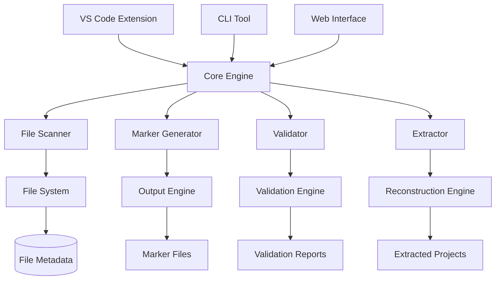
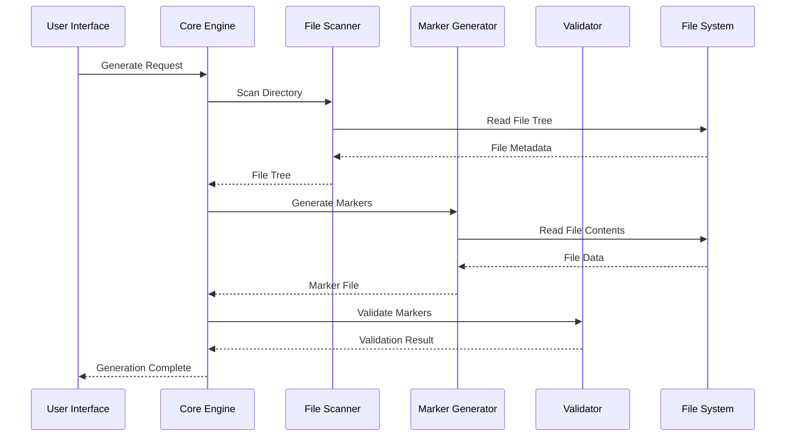

# 🏗️ Architecture Overview

Deep dive into LookAtni File Markers' architecture, design principles, and technical implementation.

## System Architecture

### High-Level Overview



### Core Components

#### 1. File Scanner (`FileScanner`)

**Purpose**: Discovers and analyzes project files

```typescript
interface FileScanner {
  scan(options: ScanOptions): Promise<FileTree>;
  analyzeFile(path: string): Promise<FileMetadata>;
  detectDependencies(file: FileInfo): Promise<Dependency[]>;
}

interface ScanOptions {
  source: string;
  include: string[];
  exclude: string[];
  followSymlinks: boolean;
  maxDepth: number;
  parallel: boolean;
}
```

**Key Features**:
- **Recursive directory traversal** with glob pattern support
- **Dependency analysis** for import/require statements
- **File type detection** using extension and content analysis
- **Metadata extraction** (size, modified date, permissions)
- **Parallel processing** for performance optimization

#### 2. Marker Generator (`MarkerGenerator`)

**Purpose**: Creates structured marker files from scanned projects

```typescript
interface MarkerGenerator {
  generate(fileTree: FileTree, options: GenerateOptions): Promise<MarkerFile>;
  createMarker(file: FileInfo): MarkerEntry;
  compress(content: string): Promise<Buffer>;
}

interface MarkerEntry {
  path: string;
  metadata: FileMetadata;
  content: string;
  encoding: string;
  boundaries: MarkerBoundaries;
}
```

**Marker Format Structure**:
```
═══════════════════════════════════════════════════════════════
📁 PROJECT: {project-name}
🗂️ FILE: {relative-path}
📊 SIZE: {file-size} | 📅 MODIFIED: {iso-timestamp}
🔧 TYPE: {file-type} | 💾 ENCODING: {encoding}
═══════════════════════════════════════════════════════════════
{file-content}
═══════════════════════════════════════════════════════════════
```

#### 3. Validator (`ValidationEngine`)

**Purpose**: Ensures marker file integrity and consistency

```typescript
interface ValidationEngine {
  validate(markerFile: MarkerFile): Promise<ValidationResult>;
  validateStructure(content: string): StructureValidation;
  validateDependencies(files: MarkerEntry[]): DependencyValidation;
  suggestFixes(errors: ValidationError[]): FixSuggestion[];
}

interface ValidationResult {
  isValid: boolean;
  score: number;
  errors: ValidationError[];
  warnings: ValidationWarning[];
  suggestions: FixSuggestion[];
  metrics: ValidationMetrics;
}
```

#### 4. Extractor (`ExtractionEngine`)

**Purpose**: Reconstructs projects from marker files

```typescript
interface ExtractionEngine {
  extract(markerFile: MarkerFile, options: ExtractOptions): Promise<ExtractionResult>;
  parseMarkers(content: string): MarkerEntry[];
  reconstructFile(entry: MarkerEntry, outputPath: string): Promise<void>;
  handleConflicts(conflicts: FileConflict[]): Promise<ConflictResolution[]>;
}

interface ExtractOptions {
  outputDirectory: string;
  overwriteExisting: boolean;
  createBackups: boolean;
  preserveTimestamps: boolean;
  filterPatterns?: string[];
}
```

## Design Principles

### 1. **Portability First**

All marker files are designed to be completely self-contained:

- **Plain text format** - readable across all platforms
- **No external dependencies** - everything needed is embedded
- **UTF-8 encoding** - universal character support
- **Cross-platform paths** - normalized path separators

### 2. **Integrity Preservation**

Ensuring perfect fidelity during the generate → extract cycle:

```typescript
class IntegrityManager {
  // Checksum validation
  generateChecksum(content: string): string {
    return crypto.createHash('sha256').update(content).digest('hex');
  }
  
  // Binary file handling
  encodeBase64(buffer: Buffer): string {
    return buffer.toString('base64');
  }
  
  // Metadata preservation
  preserveMetadata(source: string, target: string): void {
    const stats = fs.statSync(source);
    fs.utimesSync(target, stats.atime, stats.mtime);
  }
}
```

### 3. **Performance Optimization**

Scalable architecture for projects of all sizes:

```typescript
class PerformanceOptimizer {
  // Streaming for large files
  async streamLargeFile(path: string): Promise<AsyncIterable<string>> {
    const stream = fs.createReadStream(path, { encoding: 'utf8' });
    return this.createChunkedIterator(stream);
  }
  
  // Parallel processing
  async processInParallel<T>(
    items: T[], 
    processor: (item: T) => Promise<any>,
    concurrency: number = 4
  ): Promise<any[]> {
    // Implementation with worker pool
  }
  
  // Memory management
  cleanupTempFiles(): void {
    // Cleanup temporary files and caches
  }
}
```

### 4. **Extensibility**

Plugin architecture for custom functionality:

```typescript
interface Plugin {
  name: string;
  version: string;
  hooks: PluginHooks;
}

interface PluginHooks {
  beforeScan?(options: ScanOptions): Promise<ScanOptions>;
  afterScan?(fileTree: FileTree): Promise<FileTree>;
  beforeGenerate?(entries: MarkerEntry[]): Promise<MarkerEntry[]>;
  afterGenerate?(markerFile: MarkerFile): Promise<MarkerFile>;
  beforeValidate?(content: string): Promise<string>;
  afterValidate?(result: ValidationResult): Promise<ValidationResult>;
}
```

## Technical Implementation

### File Processing Pipeline



### Data Structures

#### FileTree Structure

```typescript
interface FileTree {
  root: string;
  files: Map<string, FileInfo>;
  directories: Map<string, DirectoryInfo>;
  dependencies: DependencyGraph;
  metadata: ProjectMetadata;
}

interface FileInfo {
  path: string;
  relativePath: string;
  size: number;
  modified: Date;
  created: Date;
  type: FileType;
  encoding: string;
  checksum: string;
  dependencies: string[];
}

interface DirectoryInfo {
  path: string;
  relativePath: string;
  fileCount: number;
  totalSize: number;
  subdirectories: string[];
}
```

#### Marker File Format

```typescript
interface MarkerFile {
  version: string;
  metadata: ProjectMetadata;
  entries: MarkerEntry[];
  dependencies: DependencyGraph;
  checksum: string;
  compressionMethod?: CompressionMethod;
}

interface ProjectMetadata {
  name: string;
  version?: string;
  description?: string;
  author?: string;
  generated: Date;
  totalFiles: number;
  totalSize: number;
  lookatniVersion: string;
}
```

### Storage & Compression

#### Compression Algorithms

LookAtni supports multiple compression methods:

```typescript
enum CompressionMethod {
  NONE = 'none',
  GZIP = 'gzip',
  BROTLI = 'brotli',
  LZ4 = 'lz4'
}

class CompressionManager {
  async compress(content: string, method: CompressionMethod): Promise<Buffer> {
    switch (method) {
      case CompressionMethod.GZIP:
        return zlib.gzipSync(content);
      case CompressionMethod.BROTLI:
        return zlib.brotliCompressSync(content);
      case CompressionMethod.LZ4:
        return this.lz4Compress(content);
      default:
        return Buffer.from(content);
    }
  }
}
```

#### Binary File Handling

```typescript
class BinaryFileHandler {
  detectBinaryFile(path: string): boolean {
    const buffer = fs.readFileSync(path, { flag: 'r' });
    return this.containsNullBytes(buffer.slice(0, 8192));
  }
  
  encodeBinaryFile(path: string): string {
    const buffer = fs.readFileSync(path);
    return buffer.toString('base64');
  }
  
  decodeBinaryFile(encoded: string, outputPath: string): void {
    const buffer = Buffer.from(encoded, 'base64');
    fs.writeFileSync(outputPath, buffer);
  }
}
```

## Performance Characteristics

### Benchmarks

| Project Size | Files | Generation Time | Validation Time | Extraction Time |
|-------------|-------|-----------------|-----------------|-----------------|
| Small (1-50) | 50 | < 1s | < 0.5s | < 1s |
| Medium (51-500) | 500 | 2-5s | 1-2s | 2-4s |
| Large (501-2000) | 2000 | 5-15s | 3-8s | 5-12s |
| Enterprise (2000+) | 5000+ | 15-60s | 8-20s | 15-45s |

### Memory Usage

```typescript
class MemoryManager {
  private maxMemory: number;
  private currentUsage: number = 0;
  
  checkMemoryUsage(): MemoryInfo {
    const used = process.memoryUsage();
    return {
      heapUsed: used.heapUsed / 1024 / 1024, // MB
      heapTotal: used.heapTotal / 1024 / 1024,
      external: used.external / 1024 / 1024,
      rss: used.rss / 1024 / 1024
    };
  }
  
  enforceMemoryLimit(): void {
    const usage = this.checkMemoryUsage();
    if (usage.heapUsed > this.maxMemory) {
      this.triggerGarbageCollection();
      this.clearCaches();
    }
  }
}
```

## Error Handling & Recovery

### Error Categories

```typescript
enum ErrorCategory {
  FILE_SYSTEM = 'filesystem',
  VALIDATION = 'validation',
  PARSING = 'parsing',
  MEMORY = 'memory',
  NETWORK = 'network',
  USER_INPUT = 'user_input'
}

class ErrorHandler {
  handleError(error: Error, category: ErrorCategory): ErrorResponse {
    switch (category) {
      case ErrorCategory.FILE_SYSTEM:
        return this.handleFileSystemError(error);
      case ErrorCategory.VALIDATION:
        return this.handleValidationError(error);
      case ErrorCategory.MEMORY:
        return this.handleMemoryError(error);
      default:
        return this.handleGenericError(error);
    }
  }
  
  suggestRecovery(error: ErrorResponse): RecoveryAction[] {
    // Provide actionable recovery suggestions
  }
}
```

### Recovery Mechanisms

```typescript
class RecoveryManager {
  async attemptRecovery(error: ErrorResponse): Promise<boolean> {
    for (const action of error.recoveryActions) {
      try {
        await this.executeRecoveryAction(action);
        return true;
      } catch (recoveryError) {
        this.logRecoveryFailure(action, recoveryError);
      }
    }
    return false;
  }
  
  createCheckpoint(): Checkpoint {
    // Save current state for rollback
  }
  
  rollbackToCheckpoint(checkpoint: Checkpoint): void {
    // Restore previous state
  }
}
```

## Security Considerations

### Data Protection

```typescript
class SecurityManager {
  scanForSensitiveData(content: string): SensitiveDataWarning[] {
    const patterns = [
      /(?:password|pwd|pass)\s*[:=]\s*['\"]?([^'\"\\s]+)/gi,
      /(?:api[_-]?key|apikey)\s*[:=]\s*['\"]?([^'\"\\s]+)/gi,
      /(?:secret|token)\s*[:=]\s*['\"]?([^'\"\\s]+)/gi,
      /(?:auth[_-]?token)\s*[:=]\s*['\"]?([^'\"\\s]+)/gi
    ];
    
    return this.findMatches(content, patterns);
  }
  
  sanitizeOutput(content: string): string {
    // Remove or mask sensitive data
    return content.replace(this.getSanitizationPatterns(), '[REDACTED]');
  }
}
```

### Access Control

```typescript
interface AccessControl {
  validatePermissions(path: string): boolean;
  restrictFileTypes(extension: string): boolean;
  checkFileSize(size: number): boolean;
  validatePath(path: string): boolean;
}
```

---

Next: Explore [TypeScript Scripts](typescript-scripts.md) for advanced automation.
