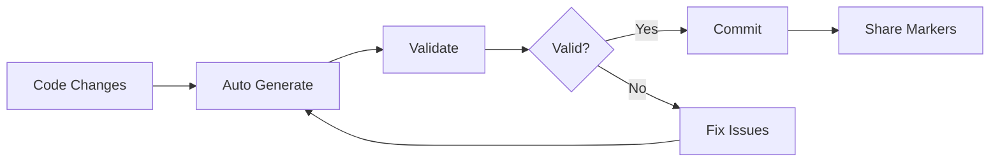

# 🔄 Workflows Guide

Advanced workflow patterns and automation strategies for LookAtni File Markers.

## Development Workflows

### Daily Development Workflow



**Implementation:**

```bash
# Development script (dev-workflow.sh)
#!/bin/bash

echo "🚀 Starting development workflow..."

# Generate markers for current changes
lookatni generate \
  --source ./src \
  --include "**/*.{ts,tsx,js,jsx}" \
  --exclude "**/*.test.*" \
  --output "dev-$(date +%H%M).txt" \
  --metadata

# Validate immediately
if lookatni validate "dev-$(date +%H%M).txt" --strict; then
  echo "✅ Markers valid - ready to share!"
  # Optional: auto-commit or share
else
  echo "❌ Validation failed - please fix issues"
  exit 1
fi
```

### Feature Branch Workflow

Perfect for sharing specific features or components:

```bash
# Feature extraction workflow
FEATURE_NAME="user-authentication"
BRANCH_NAME=$(git branch --show-current)

# Generate markers for feature-specific files
lookatni generate \
  --source . \
  --include "src/auth/**,src/components/Login/**,src/types/user.ts" \
  --output "feature-${FEATURE_NAME}.txt" \
  --preserve-structure

# Create feature documentation
echo "# Feature: ${FEATURE_NAME}" > feature-${FEATURE_NAME}.md
echo "Branch: ${BRANCH_NAME}" >> feature-${FEATURE_NAME}.md
echo "Files included in markers:" >> feature-${FEATURE_NAME}.md
lookatni analyze --source . --format txt >> feature-${FEATURE_NAME}.md
```

## CI/CD Workflows

### GitHub Actions Integration

```yaml
# .github/workflows/markers.yml
name: Generate and Validate Markers

on:
  push:
    branches: [main, develop]
  pull_request:
    branches: [main]

jobs:
  markers:
    runs-on: ubuntu-latest
    
    steps:
      - name: Checkout code
        uses: actions/checkout@v4
        
      - name: Setup Node.js
        uses: actions/setup-node@v4
        with:
          node-version: '18'
          cache: 'npm'
          
      - name: Install dependencies
        run: npm ci
        
      - name: Install LookAtni CLI
        run: npm install -g lookatni-cli
        
      - name: Generate production markers
        run: |
          lookatni generate \
            --source . \
            --include "src/**,package.json,README.md" \
            --exclude "**/*.test.*,node_modules/**" \
            --output "production-${GITHUB_SHA::8}.txt" \
            --compress --preserve-structure
            
      - name: Validate markers
        run: |
          lookatni validate "production-${GITHUB_SHA::8}.txt" \
            --strict \
            --report validation-report.json
            
      - name: Upload markers artifact
        uses: actions/upload-artifact@v4
        with:
          name: production-markers
          path: production-*.txt
          
      - name: Upload validation report
        uses: actions/upload-artifact@v4
        if: always()
        with:
          name: validation-report
          path: validation-report.json

  # Deploy markers to releases
  release:
    needs: markers
    if: github.event_name == 'push' && github.ref == 'refs/heads/main'
    runs-on: ubuntu-latest
    
    steps:
      - name: Download markers
        uses: actions/download-artifact@v4
        with:
          name: production-markers
          
      - name: Create release
        uses: softprops/action-gh-release@v1
        with:
          tag_name: v${{ github.run_number }}
          files: production-*.txt
          generate_release_notes: true
```

### GitLab CI Integration

```yaml
# .gitlab-ci.yml
stages:
  - build
  - validate
  - package
  - deploy

variables:
  LOOKATNI_VERSION: "latest"

before_script:
  - npm install -g lookatni-cli@$LOOKATNI_VERSION

generate_markers:
  stage: build
  script:
    - |
      lookatni generate \
        --source . \
        --include "src/**,docs/**,*.json,*.md" \
        --exclude "node_modules/**,*.log,coverage/**" \
        --output "project-$CI_COMMIT_SHORT_SHA.txt" \
        --compress --metadata
  artifacts:
    paths:
      - project-*.txt
    expire_in: 1 week
  only:
    - main
    - develop
    - merge_requests

validate_markers:
  stage: validate
  dependencies:
    - generate_markers
  script:
    - |
      lookatni validate project-$CI_COMMIT_SHORT_SHA.txt \
        --strict \
        --detailed \
        --report validation-$CI_COMMIT_SHORT_SHA.json
  artifacts:
    reports:
      junit: validation-*.json
  allow_failure: false

package_release:
  stage: package
  dependencies:
    - generate_markers
    - validate_markers
  script:
    - mkdir release
    - cp project-$CI_COMMIT_SHORT_SHA.txt release/
    - cp validation-$CI_COMMIT_SHORT_SHA.json release/
    - tar -czf release-$CI_COMMIT_SHORT_SHA.tar.gz release/
  artifacts:
    paths:
      - release-*.tar.gz
  only:
    - tags
```

## Educational Workflows

### Course Material Distribution

```bash
# Course setup script
#!/bin/bash

COURSE_NAME="react-fundamentals"
LESSON_NUMBER=$1

if [ -z "$LESSON_NUMBER" ]; then
  echo "Usage: $0 <lesson_number>"
  exit 1
fi

echo "📚 Preparing lesson $LESSON_NUMBER for $COURSE_NAME..."

# Create lesson-specific markers
lookatni generate \
  --source "./lessons/lesson-$LESSON_NUMBER" \
  --include "**/*.{js,jsx,css,md}" \
  --exclude "**/node_modules/**,**/.git/**" \
  --output "lesson-$LESSON_NUMBER-starter.txt" \
  --preserve-structure

# Create solution markers
lookatni generate \
  --source "./solutions/lesson-$LESSON_NUMBER" \
  --include "**/*.{js,jsx,css,md}" \
  --exclude "**/node_modules/**,**/.git/**" \
  --output "lesson-$LESSON_NUMBER-solution.txt" \
  --preserve-structure

# Validate both
lookatni validate "lesson-$LESSON_NUMBER-starter.txt"
lookatni validate "lesson-$LESSON_NUMBER-solution.txt"

echo "✅ Lesson $LESSON_NUMBER materials ready!"
echo "📁 Starter: lesson-$LESSON_NUMBER-starter.txt"
echo "💡 Solution: lesson-$LESSON_NUMBER-solution.txt"
```

### Workshop Automation

```python
# workshop-manager.py
import subprocess
import json
import os
from datetime import datetime

class WorkshopManager:
    def __init__(self, workshop_name):
        self.workshop_name = workshop_name
        self.timestamp = datetime.now().strftime("%Y%m%d_%H%M")
        
    def prepare_workshop(self):
        """Prepare all workshop materials"""
        
        # Create workshop directory structure
        os.makedirs(f"workshops/{self.workshop_name}", exist_ok=True)
        
        # Generate starter project
        self._generate_markers(
            source="./workshop-templates/starter",
            output=f"workshops/{self.workshop_name}/starter-{self.timestamp}.txt",
            description="Workshop starter files"
        )
        
        # Generate exercise solutions
        exercises = self._get_exercises()
        for i, exercise in enumerate(exercises, 1):
            self._generate_markers(
                source=f"./workshop-templates/exercises/{exercise}",
                output=f"workshops/{self.workshop_name}/exercise-{i:02d}-{exercise}.txt",
                description=f"Exercise {i}: {exercise}"
            )
            
        # Generate final project
        self._generate_markers(
            source="./workshop-templates/final",
            output=f"workshops/{self.workshop_name}/final-project.txt",
            description="Complete workshop project"
        )
        
        print(f"✅ Workshop '{self.workshop_name}' prepared successfully!")
        
    def _generate_markers(self, source, output, description):
        """Generate markers with validation"""
        
        cmd = [
            "lookatni", "generate",
            "--source", source,
            "--output", output,
            "--include", "**/*.{js,jsx,ts,tsx,css,md,json}",
            "--exclude", "node_modules/**,*.log",
            "--preserve-structure",
            "--metadata"
        ]
        
        result = subprocess.run(cmd, capture_output=True, text=True)
        
        if result.returncode == 0:
            # Validate generated markers
            validate_cmd = ["lookatni", "validate", output, "--strict"]
            validate_result = subprocess.run(validate_cmd, capture_output=True, text=True)
            
            if validate_result.returncode == 0:
                print(f"✅ {description}: {output}")
            else:
                print(f"❌ Validation failed for {output}")
        else:
            print(f"❌ Failed to generate {output}: {result.stderr}")
            
    def _get_exercises(self):
        """Get list of available exercises"""
        exercises_dir = "./workshop-templates/exercises"
        if os.path.exists(exercises_dir):
            return [d for d in os.listdir(exercises_dir) 
                   if os.path.isdir(os.path.join(exercises_dir, d))]
        return []

# Usage
if __name__ == "__main__":
    import sys
    if len(sys.argv) != 2:
        print("Usage: python workshop-manager.py <workshop_name>")
        sys.exit(1)
        
    workshop = WorkshopManager(sys.argv[1])
    workshop.prepare_workshop()
```

## Team Collaboration Workflows

### Code Review Workflow

```bash
# review-prep.sh - Prepare code for review
#!/bin/bash

PR_NUMBER=$1
BRANCH_NAME=$(git branch --show-current)

if [ -z "$PR_NUMBER" ]; then
  echo "Usage: $0 <pr_number>"
  exit 1
fi

echo "🔍 Preparing code review for PR #$PR_NUMBER..."

# Get changed files
CHANGED_FILES=$(git diff --name-only origin/main..HEAD)

echo "Changed files:"
echo "$CHANGED_FILES"

# Generate markers for changed files only
echo "$CHANGED_FILES" | tr '\n' ',' | sed 's/,$//' > changed_files.txt
INCLUDE_PATTERN=$(cat changed_files.txt)

lookatni generate \
  --source . \
  --include "$INCLUDE_PATTERN" \
  --output "review-pr-$PR_NUMBER.txt" \
  --preserve-structure \
  --metadata

# Add context files (related imports, tests, etc.)
lookatni generate \
  --source . \
  --include "$INCLUDE_PATTERN,**/*.test.*,**/*.spec.*" \
  --exclude "node_modules/**" \
  --output "review-pr-$PR_NUMBER-context.txt" \
  --preserve-structure

# Validate
lookatni validate "review-pr-$PR_NUMBER.txt"
lookatni validate "review-pr-$PR_NUMBER-context.txt"

echo "✅ Review materials ready:"
echo "📁 Changes: review-pr-$PR_NUMBER.txt"
echo "🧪 With tests: review-pr-$PR_NUMBER-context.txt"

# Cleanup
rm changed_files.txt
```

### Component Library Workflow

```bash
# component-release.sh
#!/bin/bash

COMPONENT_NAME=$1
VERSION=$2

if [ -z "$COMPONENT_NAME" ] || [ -z "$VERSION" ]; then
  echo "Usage: $0 <component_name> <version>"
  exit 1
fi

echo "📦 Releasing component $COMPONENT_NAME v$VERSION..."

# Generate component package
lookatni generate \
  --source "./src/components/$COMPONENT_NAME" \
  --include "**/*.{ts,tsx,css,md}" \
  --exclude "**/*.test.*,**/*.stories.*" \
  --output "components/$COMPONENT_NAME-$VERSION.txt" \
  --preserve-structure

# Generate with examples and tests
lookatni generate \
  --source "./src/components/$COMPONENT_NAME" \
  --include "**/*.{ts,tsx,css,md,stories.*}" \
  --output "components/$COMPONENT_NAME-$VERSION-examples.txt" \
  --preserve-structure

# Generate documentation
lookatni generate \
  --source "./docs/components/$COMPONENT_NAME" \
  --include "**/*.{md,mdx}" \
  --output "components/$COMPONENT_NAME-$VERSION-docs.txt"

# Validate all packages
for file in components/$COMPONENT_NAME-$VERSION*.txt; do
  echo "Validating $file..."
  lookatni validate "$file" --strict
done

echo "✅ Component $COMPONENT_NAME v$VERSION packaged successfully!"
```

## Backup & Archive Workflows

### Automated Backup System

```bash
# backup-system.sh
#!/bin/bash

BACKUP_DIR="/backups/projects"
PROJECT_NAME=$(basename "$PWD")
DATE=$(date +%Y%m%d)
TIME=$(date +%H%M)

echo "💾 Creating backup for $PROJECT_NAME..."

# Create backup directory
mkdir -p "$BACKUP_DIR/$PROJECT_NAME/$DATE"

# Generate different backup types
echo "Creating daily backup..."
lookatni generate \
  --source . \
  --exclude "node_modules/**,dist/**,build/**,*.log,.git/**" \
  --output "$BACKUP_DIR/$PROJECT_NAME/$DATE/daily-$TIME.txt" \
  --compress \
  --preserve-structure

echo "Creating source-only backup..."
lookatni generate \
  --source ./src \
  --output "$BACKUP_DIR/$PROJECT_NAME/$DATE/source-$TIME.txt" \
  --compress \
  --metadata

echo "Creating config backup..."
lookatni generate \
  --source . \
  --include "*.json,*.yml,*.yaml,*.toml,.*rc*,.env*" \
  --output "$BACKUP_DIR/$PROJECT_NAME/$DATE/config-$TIME.txt" \
  --preserve-structure

# Validate backups
for backup in "$BACKUP_DIR/$PROJECT_NAME/$DATE"/*.txt; do
  lookatni validate "$backup" --strict
done

# Cleanup old backups (keep last 7 days)
find "$BACKUP_DIR/$PROJECT_NAME" -type d -mtime +7 -exec rm -rf {} +

echo "✅ Backup completed successfully!"
echo "📁 Location: $BACKUP_DIR/$PROJECT_NAME/$DATE"
```

## Performance Optimization Workflows

### Large Project Handling

```bash
# large-project-workflow.sh
#!/bin/bash

PROJECT_SIZE=$(du -sh . | cut -f1)
echo "📊 Project size: $PROJECT_SIZE"

# Check if project is large (>100MB)
SIZE_BYTES=$(du -sb . | cut -f1)
LARGE_THRESHOLD=104857600  # 100MB

if [ $SIZE_BYTES -gt $LARGE_THRESHOLD ]; then
  echo "🔍 Large project detected - optimizing workflow..."
  
  # Use streaming and parallel processing
  lookatni generate \
    --source . \
    --exclude "node_modules/**,dist/**,build/**,coverage/**,*.log" \
    --output "large-project-$(date +%Y%m%d).txt" \
    --parallel=8 \
    --stream \
    --compress \
    --max-memory=4GB
    
  echo "✅ Large project processed with optimizations"
else
  echo "📝 Standard project - using normal workflow..."
  
  lookatni generate \
    --source . \
    --exclude "node_modules/**,dist/**,build/**" \
    --output "project-$(date +%Y%m%d).txt" \
    --preserve-structure \
    --metadata
fi
```

---

Next: Learn about [Best Practices](best-practices.md) for optimal LookAtni usage.
