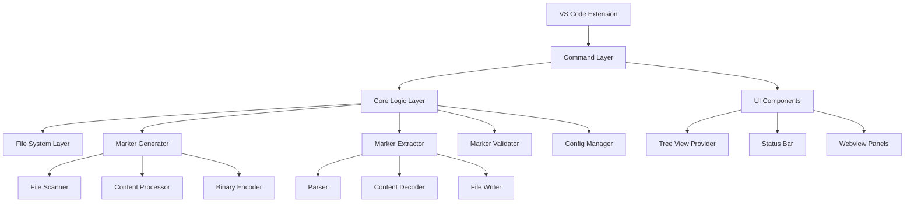
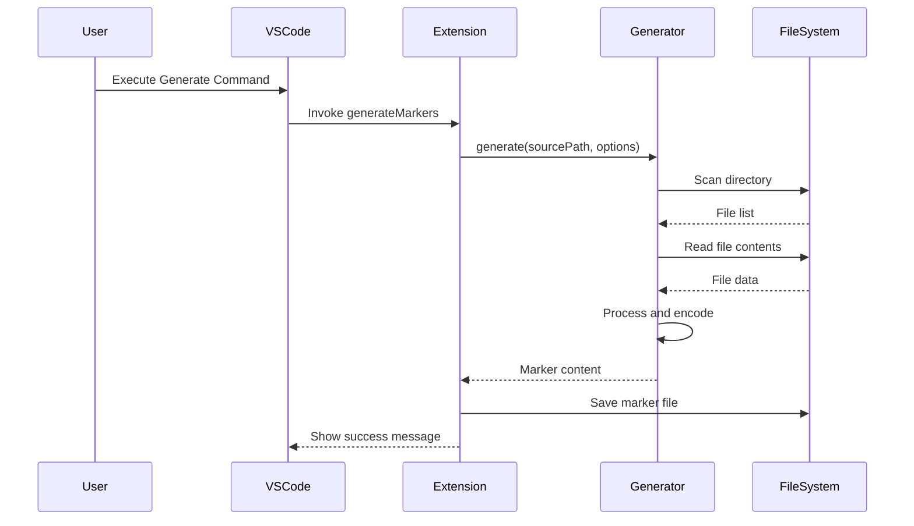
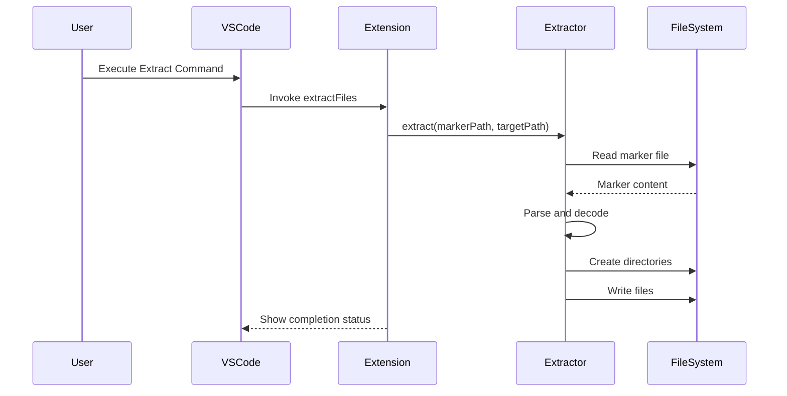

# 🛠️ Development Guide

Comprehensive guide for developers who want to contribute to LookAtni File Markers or build upon its foundation.

## 🚀 Getting Started with Development

### Development Environment Setup

#### Prerequisites

- **Node.js** 18.x or higher
- **npm** 8.x or higher  
- **VS Code** (recommended)
- **Git** for version control
- **TypeScript** knowledge

#### Clone and Setup

```bash
# Clone the repository
git clone https://github.com/kubex-ecosystem/lookatni-file-markers.git
cd lookatni-file-markers

# Install dependencies
npm install

# Build the project
npm run build

# Run tests
npm test

# Start development mode
npm run watch
```

#### Development Scripts

```bash
# TypeScript compilation (watch mode)
npm run watch:tsc

# Bundle with esbuild (watch mode)  
npm run watch:esbuild

# Run all tests
npm test

# Run tests in watch mode
npm run test:watch

# Lint code
npm run lint

# Format code
npm run format

# Generate documentation
npm run docs

# Package extension
npm run package
```

### Project Structure Deep Dive

```
lookatni-file-markers/
├── src/
│   ├── extension.ts              # VS Code extension entry point
│   ├── commands/                 # Extension commands
│   │   ├── generateMarkers.ts
│   │   ├── extractFiles.ts
│   │   ├── validateMarkers.ts
│   │   └── ...
│   ├── utils/                    # Core utilities
│   │   ├── markerGenerator.ts    # Core generation logic
│   │   ├── markerExtractor.ts    # Core extraction logic
│   │   ├── markerParser.ts       # Marker file parsing
│   │   ├── configManager.ts      # Configuration management
│   │   ├── logger.ts             # Logging system
│   │   └── ...
│   ├── views/                    # VS Code UI components
│   │   ├── explorerProvider.ts   # Tree view provider
│   │   └── ...
│   ├── scripts/                  # CLI and automation scripts
│   │   ├── cli.ts                # Command-line interface
│   │   ├── demo.ts               # Demo generation
│   │   └── ...
│   └── test/                     # Test files
│       ├── unit/                 # Unit tests
│       ├── integration/          # Integration tests
│       └── fixtures/             # Test data
├── docs/                         # Documentation
├── package.json                  # Extension manifest
├── tsconfig.json                 # TypeScript configuration
├── eslint.config.mjs            # ESLint configuration
├── esbuild.js                   # Build configuration
└── .github/                     # GitHub workflows
```

## 🏗️ Architecture Overview

### Core Components



### Data Flow

#### Generation Flow



#### Extraction Flow



## 🧪 Testing Strategy

### Test Organization

```typescript
// test/unit/markerGenerator.test.ts
import { describe, it, expect, beforeEach, afterEach } from 'mocha';
import { MarkerGenerator } from '../../src/utils/markerGenerator';
import { TestFileSystem } from '../helpers/testFileSystem';

describe('MarkerGenerator', () => {
  let generator: MarkerGenerator;
  let testFs: TestFileSystem;

  beforeEach(() => {
    generator = new MarkerGenerator();
    testFs = new TestFileSystem();
  });

  afterEach(() => {
    testFs.cleanup();
  });

  describe('generate()', () => {
    it('should generate markers for simple project', async () => {
      // Arrange
      await testFs.createFile('src/index.js', 'console.log("Hello");');
      await testFs.createFile('package.json', '{"name": "test"}');

      // Act
      const result = await generator.generate(testFs.rootPath);

      // Assert
      expect(result).to.include('=== File: src/index.js ===');
      expect(result).to.include('console.log("Hello");');
      expect(result).to.include('=== File: package.json ===');
    });

    it('should respect exclude patterns', async () => {
      // Arrange
      await testFs.createFile('src/index.js', 'console.log("Hello");');
      await testFs.createFile('node_modules/lib.js', 'module.exports = {};');

      // Act
      const result = await generator.generate(testFs.rootPath, {
        excludePatterns: ['node_modules/**']
      });

      // Assert
      expect(result).to.include('src/index.js');
      expect(result).to.not.include('node_modules/lib.js');
    });

    it('should handle binary files correctly', async () => {
      // Arrange
      const binaryData = Buffer.from([0x89, 0x50, 0x4E, 0x47]); // PNG header
      await testFs.createBinaryFile('image.png', binaryData);

      // Act
      const result = await generator.generate(testFs.rootPath);

      // Assert
      expect(result).to.include('=== Binary File: image.png ===');
      expect(result).to.include('iVBORw0KGgo'); // Base64 encoded
    });
  });

  describe('error handling', () => {
    it('should handle permission errors gracefully', async () => {
      // Test permission error handling
      await testFs.createProtectedFile('protected.txt');
      
      const result = await generator.generate(testFs.rootPath);
      
      // Should include warning about skipped file
      expect(result).to.include('// Warning: Could not read protected.txt');
    });

    it('should handle large files appropriately', async () => {
      // Test with file exceeding max size
      const largeContent = 'x'.repeat(50 * 1024 * 1024); // 50MB
      await testFs.createFile('large.txt', largeContent);

      const result = await generator.generate(testFs.rootPath, {
        maxFileSize: 10 * 1024 * 1024 // 10MB limit
      });

      expect(result).to.include('// Warning: File large.txt exceeds size limit');
    });
  });
});
```

### Integration Tests

```typescript
// test/integration/endToEnd.test.ts
import { describe, it, expect } from 'mocha';
import { MarkerGenerator } from '../../src/utils/markerGenerator';
import { MarkerExtractor } from '../../src/utils/markerExtractor';
import { TestProject } from '../helpers/testProject';

describe('End-to-End Tests', () => {
  it('should generate and extract a complete project', async () => {
    // Create test project
    const project = new TestProject();
    await project.create({
      'package.json': '{"name": "test-project", "version": "1.0.0"}',
      'src/index.js': 'console.log("Hello World");',
      'src/utils/helper.js': 'module.exports = { helper: () => {} };',
      'README.md': '# Test Project\n\nThis is a test.',
      'assets/logo.png': Buffer.from('fake-png-data')
    });

    // Generate markers
    const generator = new MarkerGenerator();
    const markerContent = await generator.generate(project.path);

    // Extract to new location
    const extractor = new MarkerExtractor();
    const extractPath = project.createTempDir();
    await extractor.extract(markerContent, extractPath);

    // Verify extracted files match original
    await project.verifyExtracted(extractPath);
  });

  it('should handle complex project structures', async () => {
    const project = new TestProject();
    await project.createComplexStructure();

    const generator = new MarkerGenerator();
    const extractor = new MarkerExtractor();

    const marker = await generator.generate(project.path);
    const extractPath = project.createTempDir();
    await extractor.extract(marker, extractPath);

    await project.verifyComplexStructure(extractPath);
  });
});
```

### VS Code Extension Tests

```typescript
// test/integration/extension.test.ts
import * as vscode from 'vscode';
import { describe, it, expect, before } from 'mocha';

describe('Extension Integration', () => {
  before(async () => {
    // Ensure extension is activated
    const extension = vscode.extensions.getExtension('rafa-mori.lookatni-file-markers');
    if (extension && !extension.isActive) {
      await extension.activate();
    }
  });

  it('should register all commands', async () => {
    const commands = await vscode.commands.getCommands();
    
    const expectedCommands = [
      'lookatni.generateMarkers',
      'lookatni.extractFiles',
      'lookatni.validateMarkers',
      'lookatni.quickDemo',
      'lookatni.openCLI'
    ];

    expectedCommands.forEach(command => {
      expect(commands).to.include(command);
    });
  });

  it('should execute generate command successfully', async () => {
    // Create test workspace
    const workspaceUri = vscode.Uri.file('/tmp/test-workspace');
    await vscode.workspace.fs.createDirectory(workspaceUri);

    // Execute command
    const result = await vscode.commands.executeCommand(
      'lookatni.generateMarkers',
      workspaceUri
    );

    expect(result).to.be.true;
  });
});
```

### Test Helpers

```typescript
// test/helpers/testFileSystem.ts
import * as fs from 'fs-extra';
import * as path from 'path';
import * as os from 'os';

export class TestFileSystem {
  public readonly rootPath: string;

  constructor() {
    this.rootPath = fs.mkdtempSync(path.join(os.tmpdir(), 'lookatni-test-'));
  }

  async createFile(relativePath: string, content: string): Promise<void> {
    const fullPath = path.join(this.rootPath, relativePath);
    await fs.ensureDir(path.dirname(fullPath));
    await fs.writeFile(fullPath, content, 'utf-8');
  }

  async createBinaryFile(relativePath: string, data: Buffer): Promise<void> {
    const fullPath = path.join(this.rootPath, relativePath);
    await fs.ensureDir(path.dirname(fullPath));
    await fs.writeFile(fullPath, data);
  }

  async createProtectedFile(relativePath: string): Promise<void> {
    await this.createFile(relativePath, 'protected content');
    const fullPath = path.join(this.rootPath, relativePath);
    await fs.chmod(fullPath, 0o000); // No permissions
  }

  async readFile(relativePath: string): Promise<string> {
    const fullPath = path.join(this.rootPath, relativePath);
    return await fs.readFile(fullPath, 'utf-8');
  }

  async exists(relativePath: string): Promise<boolean> {
    const fullPath = path.join(this.rootPath, relativePath);
    return await fs.pathExists(fullPath);
  }

  cleanup(): void {
    fs.removeSync(this.rootPath);
  }
}
```

## 🔧 Core Development Patterns

### Error Handling Strategy

```typescript
// src/utils/errorHandling.ts
export class LookatniError extends Error {
  constructor(
    message: string,
    public readonly code: string,
    public readonly context?: Record<string, any>
  ) {
    super(message);
    this.name = 'LookatniError';
  }
}

export class FileProcessingError extends LookatniError {
  constructor(filePath: string, originalError: Error) {
    super(
      `Failed to process file: ${filePath}`,
      'FILE_PROCESSING_ERROR',
      { filePath, originalError: originalError.message }
    );
  }
}

export class ValidationError extends LookatniError {
  constructor(message: string, line?: number) {
    super(message, 'VALIDATION_ERROR', { line });
  }
}

// Usage in generator
export class MarkerGenerator {
  async generate(sourcePath: string, options?: GenerationOptions): Promise<string> {
    try {
      return await this.performGeneration(sourcePath, options);
    } catch (error) {
      if (error instanceof LookatniError) {
        throw error;
      } else {
        throw new LookatniError(
          `Unexpected error during generation: ${error.message}`,
          'GENERATION_ERROR',
          { sourcePath, originalError: error.message }
        );
      }
    }
  }
}
```

### Configuration Management

```typescript
// src/utils/configManager.ts
interface ConfigValue {
  value: any;
  source: 'default' | 'global' | 'project' | 'runtime';
  timestamp: Date;
}

export class ConfigManager {
  private configCache = new Map<string, ConfigValue>();
  private watchers: ConfigWatcher[] = [];

  async getValue<T>(key: string, defaultValue?: T): Promise<T> {
    // Check cache first
    const cached = this.configCache.get(key);
    if (cached && this.isCacheValid(cached)) {
      return cached.value;
    }

    // Load from sources in priority order
    const value = await this.loadFromSources(key, defaultValue);
    
    // Cache the result
    this.configCache.set(key, {
      value,
      source: this.determineSource(key),
      timestamp: new Date()
    });

    return value;
  }

  async setValue<T>(key: string, value: T, scope: ConfigScope): Promise<void> {
    await this.writeToScope(key, value, scope);
    
    // Update cache
    this.configCache.set(key, {
      value,
      source: scope,
      timestamp: new Date()
    });

    // Notify watchers
    this.notifyWatchers(key, value, scope);
  }

  watch(pattern: string, callback: ConfigChangeCallback): ConfigWatcher {
    const watcher = new ConfigWatcher(pattern, callback);
    this.watchers.push(watcher);
    return watcher;
  }

  private async loadFromSources<T>(key: string, defaultValue?: T): Promise<T> {
    // Try runtime config first
    let value = await this.loadFromRuntime(key);
    if (value !== undefined) return value;

    // Try project config
    value = await this.loadFromProject(key);
    if (value !== undefined) return value;

    // Try global config
    value = await this.loadFromGlobal(key);
    if (value !== undefined) return value;

    // Return default
    return defaultValue as T;
  }
}
```

### Logging System

```typescript
// src/utils/logger.ts
export enum LogLevel {
  ERROR = 0,
  WARN = 1,
  INFO = 2,
  DEBUG = 3,
  TRACE = 4
}

export interface LogEntry {
  timestamp: Date;
  level: LogLevel;
  message: string;
  context?: Record<string, any>;
  stack?: string;
}

export class Logger {
  private static instance: Logger;
  private loggers = new Map<string, ChannelLogger>();
  private level: LogLevel = LogLevel.INFO;

  static getInstance(): Logger {
    if (!Logger.instance) {
      Logger.instance = new Logger();
    }
    return Logger.instance;
  }

  getLogger(channel: string): ChannelLogger {
    if (!this.loggers.has(channel)) {
      this.loggers.set(channel, new ChannelLogger(channel, this));
    }
    return this.loggers.get(channel)!;
  }

  setLevel(level: LogLevel): void {
    this.level = level;
  }

  log(entry: LogEntry): void {
    if (entry.level <= this.level) {
      this.writeLog(entry);
    }
  }

  private writeLog(entry: LogEntry): void {
    // Write to console
    console.log(`[${entry.timestamp.toISOString()}] ${LogLevel[entry.level]} ${entry.message}`);
    
    // Write to file if configured
    // this.writeToFile(entry);
    
    // Send to VS Code output channel
    // this.writeToOutputChannel(entry);
  }
}

export class ChannelLogger {
  constructor(
    private channel: string,
    private parent: Logger
  ) {}

  error(message: string, context?: Record<string, any>): void {
    this.parent.log({
      timestamp: new Date(),
      level: LogLevel.ERROR,
      message: `[${this.channel}] ${message}`,
      context,
      stack: new Error().stack
    });
  }

  warn(message: string, context?: Record<string, any>): void {
    this.parent.log({
      timestamp: new Date(),
      level: LogLevel.WARN,
      message: `[${this.channel}] ${message}`,
      context
    });
  }

  info(message: string, context?: Record<string, any>): void {
    this.parent.log({
      timestamp: new Date(),
      level: LogLevel.INFO,
      message: `[${this.channel}] ${message}`,
      context
    });
  }

  debug(message: string, context?: Record<string, any>): void {
    this.parent.log({
      timestamp: new Date(),
      level: LogLevel.DEBUG,
      message: `[${this.channel}] ${message}`,
      context
    });
  }
}

// Usage
const logger = Logger.getInstance().getLogger('MarkerGenerator');
logger.info('Starting marker generation', { sourcePath: '/project' });
logger.error('Failed to read file', { filePath: '/project/file.txt', error: 'ENOENT' });
```

### Performance Monitoring

```typescript
// src/utils/performance.ts
export class PerformanceProfiler {
  private timings = new Map<string, number>();
  private counters = new Map<string, number>();
  private memory = new Map<string, number>();

  startTiming(operation: string): void {
    this.timings.set(operation, performance.now());
  }

  endTiming(operation: string): number {
    const start = this.timings.get(operation);
    if (start === undefined) {
      throw new Error(`No timing started for operation: ${operation}`);
    }
    
    const duration = performance.now() - start;
    this.timings.delete(operation);
    
    return duration;
  }

  increment(counter: string, value: number = 1): void {
    const current = this.counters.get(counter) || 0;
    this.counters.set(counter, current + value);
  }

  recordMemory(label: string): void {
    const usage = process.memoryUsage();
    this.memory.set(label, usage.heapUsed);
  }

  generateReport(): PerformanceReport {
    return {
      timestamp: new Date(),
      counters: Object.fromEntries(this.counters),
      memorySnapshots: Object.fromEntries(this.memory),
      summary: this.calculateSummary()
    };
  }
}

// Usage in MarkerGenerator
export class MarkerGenerator {
  private profiler = new PerformanceProfiler();

  async generate(sourcePath: string, options?: GenerationOptions): Promise<string> {
    this.profiler.startTiming('total_generation');
    this.profiler.recordMemory('start');

    try {
      const files = await this.scanFiles(sourcePath);
      this.profiler.increment('files_scanned', files.length);

      let result = await this.generateHeader(sourcePath, options);

      for (const file of files) {
        this.profiler.startTiming('file_processing');
        
        const processed = await this.processFile(file);
        result += processed;
        
        const duration = this.profiler.endTiming('file_processing');
        this.profiler.increment('processing_time', duration);
      }

      this.profiler.recordMemory('end');
      const totalTime = this.profiler.endTiming('total_generation');

      const report = this.profiler.generateReport();
      this.logger.debug('Generation performance', report);

      return result;
    } catch (error) {
      this.profiler.endTiming('total_generation');
      throw error;
    }
  }
}
```

## 🔄 Development Workflow

### Code Style and Standards

```typescript
// .eslintrc.js
module.exports = {
  parser: '@typescript-eslint/parser',
  plugins: ['@typescript-eslint'],
  extends: [
    'eslint:recommended',
    '@typescript-eslint/recommended'
  ],
  rules: {
    // Enforce consistent code style
    'indent': ['error', 2],
    'quotes': ['error', 'single'],
    'semi': ['error', 'always'],
    
    // TypeScript specific
    '@typescript-eslint/no-unused-vars': 'error',
    '@typescript-eslint/explicit-function-return-type': 'warn',
    '@typescript-eslint/no-explicit-any': 'warn',
    
    // Best practices
    'prefer-const': 'error',
    'no-var': 'error',
    'object-shorthand': 'error'
  }
};
```

### Git Workflow

```bash
# Feature development workflow
git checkout -b feature/your-feature-name

# Make changes...
npm run lint
npm test
npm run build

# Commit with conventional commits
git commit -m "feat: add new marker validation feature"

# Push and create PR
git push origin feature/your-feature-name
```

### Release Process

```bash
# Update version
npm version patch|minor|major

# Update changelog
# Update documentation

# Create release build
npm run build
npm run package

# Create GitHub release
# Publish to VS Code Marketplace
```

---

## 📚 Development Resources

### Essential Documentation

- [VS Code Extension API](https://code.visualstudio.com/api)
- [TypeScript Handbook](https://www.typescriptlang.org/docs/)
- [Node.js Documentation](https://nodejs.org/docs/)
- [Mocha Testing Framework](https://mochajs.org/)

### Development Tools

- **VS Code Extensions**:
  - TypeScript Importer
  - ESLint
  - Prettier
  - GitLens
  - Extension Test Runner

- **CLI Tools**:
  - `vsce` - VS Code Extension manager
  - `typescript` - TypeScript compiler
  - `eslint` - Code linting
  - `mocha` - Test runner

### Debugging Configuration

```json
// .vscode/launch.json
{
  "version": "0.2.0",
  "configurations": [
    {
      "name": "Run Extension",
      "type": "extensionHost",
      "request": "launch",
      "args": ["--extensionDevelopmentPath=${workspaceFolder}"],
      "outFiles": ["${workspaceFolder}/out/**/*.js"],
      "preLaunchTask": "${workspaceFolder}/npm: watch"
    },
    {
      "name": "Extension Tests",
      "type": "extensionHost",
      "request": "launch",
      "args": [
        "--extensionDevelopmentPath=${workspaceFolder}",
        "--extensionTestsPath=${workspaceFolder}/out/test/suite/index"
      ],
      "outFiles": ["${workspaceFolder}/out/test/**/*.js"],
      "preLaunchTask": "${workspaceFolder}/npm: watch"
    }
  ]
}
```

This comprehensive development guide provides everything needed to contribute effectively to the LookAtni File Markers project while maintaining high code quality and consistency.
