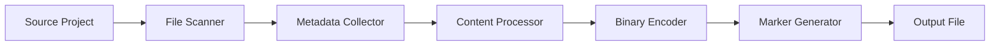
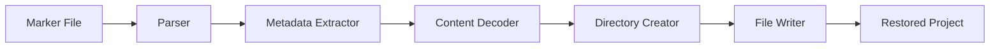
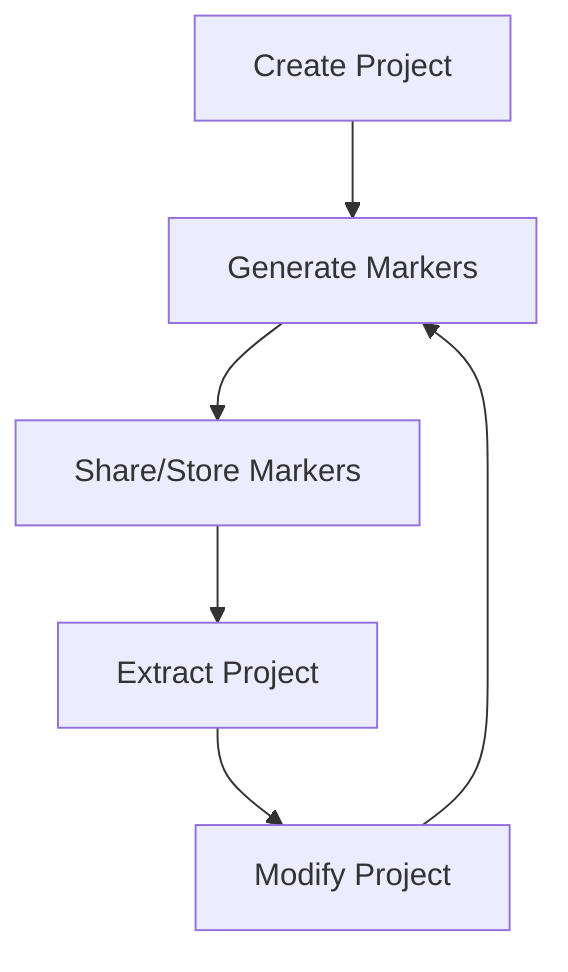
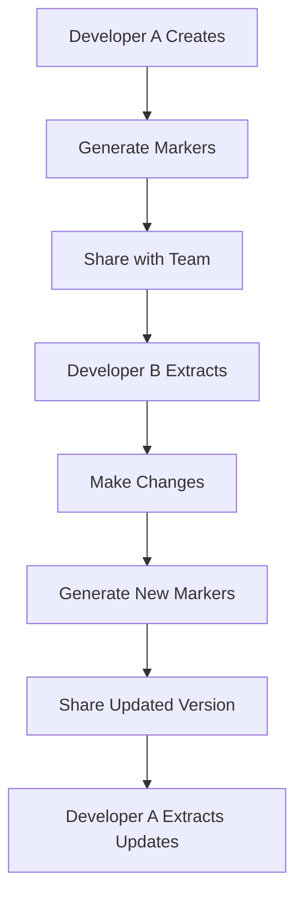
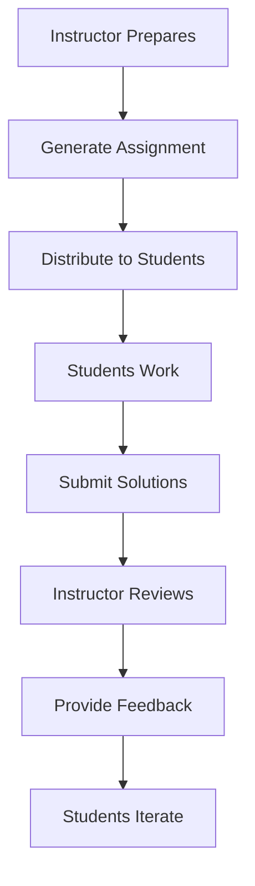

# 🎯 Getting Started Concepts

Understanding the core concepts behind LookAtni File Markers and how they work together to create a powerful project management system.

## 🧩 Core Concepts

### What Are File Markers?

File markers are self-contained, human-readable text files that represent complete projects or directories. Think of them as "DNA" for your projects - they contain all the information needed to recreate the exact structure and content.

```text
// === LookAtni File Markers v1.0.6 ===
// Generated: 2025-01-20T10:30:00Z
// Source: /my-awesome-project
// Files: 15 | Size: 2.3MB | Compressed: true

// === File: package.json ===
// Size: 1.2KB | Modified: 2025-01-20T09:15:30Z
{
  "name": "my-awesome-project",
  "version": "1.0.0",
  "description": "An amazing project"
}

// === File: src/index.js ===
// Size: 0.8KB | Modified: 2025-01-20T09:20:15Z
console.log('Hello, LookAtni!');

// === Binary File: assets/logo.png ===
// Size: 15.3KB | Type: image/png | Encoded: base64
iVBORw0KGgoAAAANSUhEUgAAAAEAAAABCAYAAAAfFcSJAAAADU...
```

### Key Principles

#### 📝 **Human-Readable Format**
File markers use plain text with clear delimiters, making them easy to read, edit, and understand without special tools.

#### 🔄 **Bidirectional Conversion**
- **Generation**: Project → Marker file
- **Extraction**: Marker file → Project

#### 🎯 **Metadata Preservation**
File timestamps, permissions, sizes, and other metadata are preserved during the conversion process.

#### 📦 **Self-Contained**
A marker file contains everything needed to recreate the project, including binary files (encoded as base64).

## 🛠️ How It Works

### The Generation Process



1. **File Scanning**: Recursively scan project directory
2. **Metadata Collection**: Gather file information (size, dates, permissions)
3. **Content Processing**: Read text files and process content
4. **Binary Encoding**: Convert binary files to base64
5. **Marker Generation**: Combine everything into marker format
6. **Output**: Save as `.lookatni` file

### The Extraction Process



1. **Parsing**: Parse marker file structure
2. **Metadata Extraction**: Extract file information
3. **Content Decoding**: Decode binary content from base64
4. **Directory Creation**: Recreate directory structure
5. **File Writing**: Write files with original content
6. **Restoration**: Apply original timestamps and permissions

## 🎨 Marker File Anatomy

### Header Section

```text
// === LookAtni File Markers v1.0.6 ===
// Generated: 2025-01-20T10:30:00Z
// Source: /my-awesome-project
// Files: 15 | Size: 2.3MB | Compressed: true
// Generator: VS Code Extension
// Options: include-metadata, exclude-node-modules
```

The header contains:
- Version information
- Generation timestamp
- Source path
- Statistics (file count, total size)
- Generator information
- Generation options used

### File Entries

Each file in the project becomes an entry in the marker:

```text
// === File: src/components/Button.jsx ===
// Size: 1.5KB | Modified: 2025-01-20T09:25:10Z
// Type: text/javascript | Encoding: utf-8
import React from 'react';

export const Button = ({ children, onClick }) => {
  return (
    <button onClick={onClick} className="btn">
      {children}
    </button>
  );
};
```

### Binary File Handling

Binary files are encoded for inclusion:

```text
// === Binary File: assets/icon.png ===
// Size: 2.3KB | Type: image/png | Encoded: base64
iVBORw0KGgoAAAANSUhEUgAAACAAAAAgCAYAAABzenr0AAAABHNCSVQICAgIfAhkiAAAAAlwSFlz...
```

### Directory Structure

Directories are represented implicitly through file paths, but can also be explicitly defined:

```text
// === Directory: src/components ===
// Created: 2025-01-19T14:20:00Z | Permissions: 755

// === Directory: assets/images ===
// Created: 2025-01-19T14:22:00Z | Permissions: 755
```

## 🔧 Configuration System

### Global Configuration

LookAtni uses a hierarchical configuration system:

1. **Built-in defaults**
2. **Global user settings** (`~/.lookatni/config.json`)
3. **Project-specific settings** (`.lookatni.json` in project root)
4. **Command-line arguments** (highest priority)

### Configuration Options

```json
{
  "includeMetadata": true,
  "compressionLevel": 1,
  "excludePatterns": [
    "node_modules/**",
    ".git/**",
    "dist/**",
    "*.log",
    ".DS_Store"
  ],
  "includeBinaryFiles": true,
  "maxFileSize": "10MB",
  "encoding": "utf-8",
  "preserveTimestamps": true,
  "validateOnExtract": true
}
```

## 🎯 Use Case Categories

### 📚 **Educational**
- **Code Sharing**: Share complete projects with students
- **Assignment Distribution**: Distribute starter code and solutions
- **Portfolio Building**: Students maintain project collections
- **Peer Review**: Easy sharing for code reviews

### 🏢 **Professional**
- **Code Documentation**: Create comprehensive project snapshots
- **Backup & Recovery**: Portable project backups
- **Collaboration**: Share project states with team members
- **Client Delivery**: Package complete solutions for clients

### 🔬 **Research & Development**
- **Experiment Tracking**: Save different experiment states
- **Reproducible Research**: Share complete research environments
- **Version Snapshots**: Capture specific project versions
- **Comparative Analysis**: Compare different implementation approaches

## 🌐 Ecosystem Integration

### VS Code Extension

The primary interface for LookAtni, providing:
- Command palette integration
- File explorer context menus
- Visual markers and navigation
- Automated workflows
- Status bar information

### Command-Line Interface

For automation and scripting:
```bash
# Generate markers
lookatni generate --source ./my-project --output project.lookatni

# Extract project
lookatni extract --input project.lookatni --output ./restored-project

# Validate marker file
lookatni validate project.lookatni

# Compare projects
lookatni diff --source ./project-v1 --target ./project-v2
```

### API Integration

For programmatic access:
```typescript
import { MarkerGenerator, MarkerExtractor } from 'lookatni-core';

const generator = new MarkerGenerator();
const marker = await generator.generate('./project-path');

const extractor = new MarkerExtractor();
await extractor.extract(marker, './output-path');
```

## 🔄 Workflow Patterns

### Basic Workflow



### Collaborative Workflow



### Educational Workflow



## 🛡️ Security Considerations

### Data Protection

- **No Sensitive Data**: Markers are plain text - avoid including secrets
- **Access Control**: Store markers securely based on project sensitivity
- **Audit Trail**: Track marker generation and usage
- **Encryption**: Use external encryption for sensitive projects

### Best Practices

1. **Review Before Sharing**: Always review marker content before sharing
2. **Use Exclusion Patterns**: Exclude sensitive files and directories
3. **Validate Sources**: Verify marker sources before extraction
4. **Secure Storage**: Use appropriate storage for different sensitivity levels

---

## 🎓 Learning Path

### Beginner Level
1. **Basic Generation**: Create your first marker file
2. **Simple Extraction**: Restore a project from markers
3. **VS Code Integration**: Use extension commands
4. **Configuration**: Customize basic settings

### Intermediate Level
1. **Advanced Configuration**: Complex exclusion patterns and options
2. **CLI Usage**: Command-line operations and scripting
3. **Workflow Integration**: Incorporate into development workflow
4. **Collaboration**: Share and manage team projects

### Advanced Level
1. **API Integration**: Programmatic marker management
2. **Custom Automation**: Build automated workflows
3. **Extension Development**: Extend LookAtni functionality
4. **Enterprise Deployment**: Large-scale organizational usage

Understanding these core concepts provides the foundation for effectively using LookAtni File Markers in your projects and workflows. The system's simplicity and power come from these well-designed fundamental principles.
